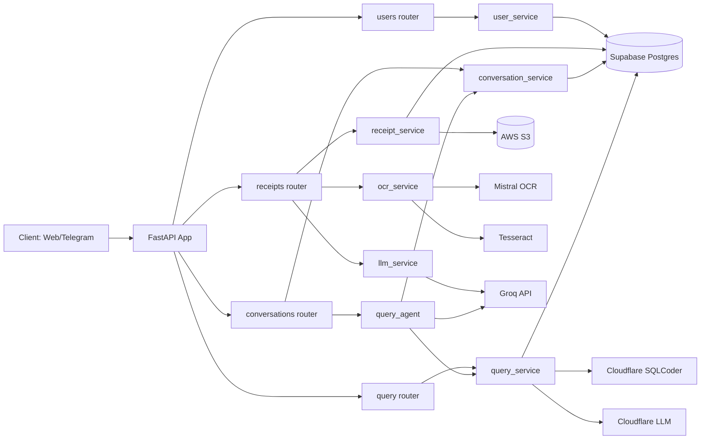
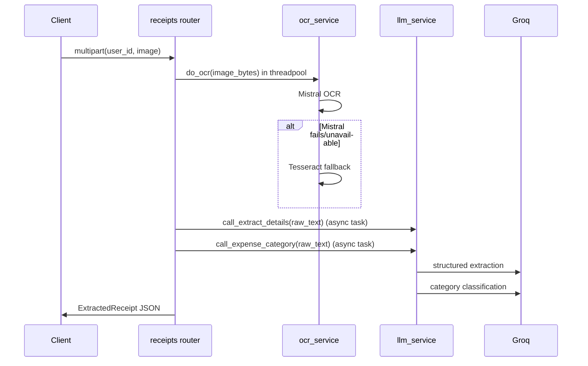
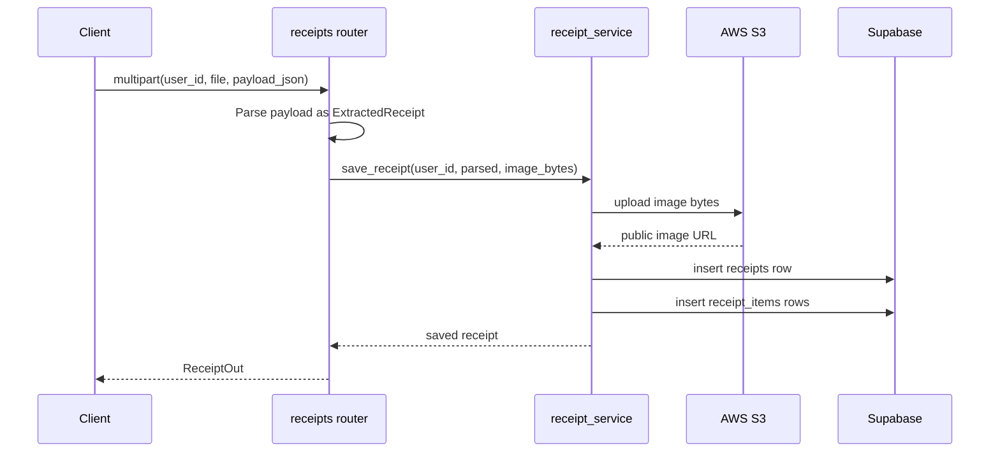
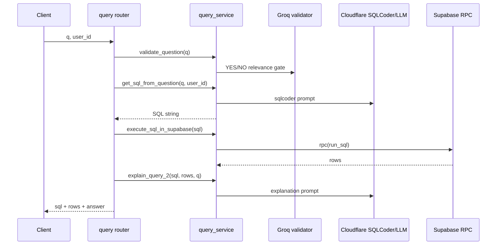
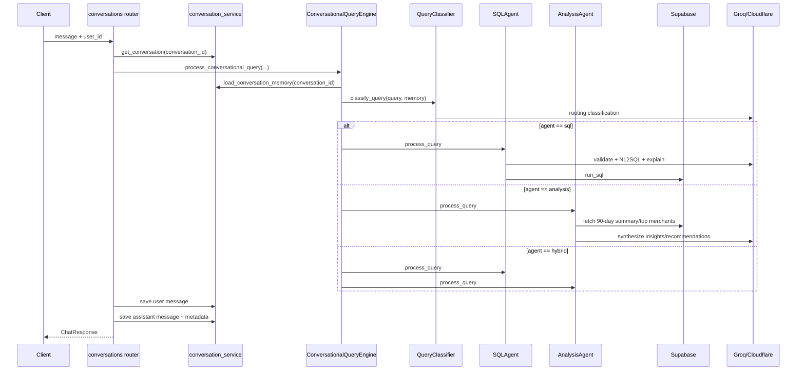

# TrackIt-AI Backend Architecture (LLD)

## 1. Scope

This document describes the low-level backend design for the agentic AI solution in `backend/`, based on the current implementation.

Primary capabilities:
- Receipt OCR and structuring
- Receipt persistence (image + structured records)
- Natural-language expense querying (text-to-SQL)
- Multi-turn conversational expense assistant with agent routing

## 2. Runtime and Deployment View

### Runtime Stack
- API framework: FastAPI (`main.py`)
- Async model: `asyncio` event loop + threadpool offloading for blocking work
- Database: Supabase Postgres
- Object storage: AWS S3
- LLM/OCR providers:
  - Groq (classification, extraction, some analysis)
  - Cloudflare Workers AI (`sqlcoder-7b-2`, `llama-4-scout`) for SQL generation and answer explanation
  - Mistral OCR with Tesseract fallback

### Entry Point
- `backend/main.py`
  - Configures CORS for local frontend
  - Registers routers:
    - `/users`
    - `/receipts`
    - `/query`
    - `/conversations`

## 3. Package/Module Decomposition

### API Layer (`routers/`)
- `users.py`
  - Signup/login endpoints
  - Delegates to `user_service`
- `receipts.py`
  - `/extract`: OCR + LLM parse/category
  - `/save`: S3 upload + DB inserts
  - Receipt list/items fetch
- `query.py`
  - `/ask`: validate -> NL2SQL -> SQL execute -> explanation
- `conversations.py`
  - Conversation CRUD + chat endpoint
  - Uses `ConversationalQueryEngine` orchestration

### Service Layer (`services/`)
- `supabase_client.py`
  - Creates shared Supabase client
  - Contains password hashing helper
- `user_service.py`
  - User create/authenticate using `users` table
- `ocr_service.py`
  - OCR via Mistral, fallback Tesseract
- `llm_service.py`
  - Receipt detail extraction + category classification
- `s3_client.py`
  - Upload image bytes to S3; returns public URL
- `receipt_service.py`
  - Save receipt + line items
  - Read receipts/items
- `query_service.py`
  - Guardrail classifier (`validate_question`)
  - NL2SQL generation
  - SQL execution via Supabase RPC `run_sql`
  - Result explanation with LLM
- `conversation_service.py`
  - Conversation/message persistence
  - In-memory context assembler (`ConversationMemory`)
  - Heuristic context extraction from query text
- `query_agent.py`
  - `QueryClassifier`: selects `sql` / `analysis` / `hybrid`
  - `SQLAgent`: SQL retrieval path
  - `AnalysisAgent`: insight/recommendation path
  - `ConversationalQueryEngine`: orchestrates full flow

### Schema and Prompt Layer
- `schemas/`: Pydantic request/response contracts
- `constants/schemas.py`: JSON schema constraints for LLM structured output
- `prompts/`: NL validation, SQL generation, explanation, receipt extraction prompts

## 4. Component Interaction Diagram

## 5. API Surface (Current)

### Users
- `POST /users/signup`
- `POST /users/login`

### Receipts
- `POST /receipts/extract` (multipart: `user_id`, `file`)
- `POST /receipts/save` (multipart: `user_id`, `file`, `payload`)
- `GET /receipts/user/{user_id}?limit&offset`
- `GET /receipts/{receipt_id}/items`

### Query
- `POST /query/ask` (`q`, `user_id`)

### Conversations
- `POST /conversations/`
- `GET /conversations/user/{user_id}`
- `GET /conversations/{conversation_id}`
- `GET /conversations/{conversation_id}/messages`
- `POST /conversations/{conversation_id}/chat?user_id=...`
- `DELETE /conversations/{conversation_id}`
- `POST /conversations/quick-query?user_id=...`

## 6. Data Model (Supabase/Postgres)

Defined in `models/schemas.sql`.

### Core Tables
- `users`
  - `id`, `email` (unique), `password_hash`, `name`
- `receipts`
  - FK `user_id -> users.id`
  - Merchant metadata, dates, subtotal/tax/total, category, payment method, image URL
- `receipt_items`
  - FK `receipt_id -> receipts.id`
  - Item description, unit price, quantity, derived line total
- `conversations`
  - FK `user_id -> users.id`
  - Title, timestamps, message count, active flag
- `conversation_messages`
  - FK `conversation_id -> conversations.id`
  - Role, content, metadata JSON, timestamp

## 7. Detailed Request Flows

### 7.1 Receipt Extraction (`POST /receipts/extract`)

Notes:
- OCR is offloaded using `run_in_executor` with a dedicated `ThreadPoolExecutor(max_workers=4)`.
- Extraction and categorization LLM calls run concurrently via `asyncio.gather`.

### 7.2 Receipt Save (`POST /receipts/save`)

### 7.3 One-shot NL Query (`POST /query/ask`)

### 7.4 Conversational Agent Query (`POST /conversations/{id}/chat`)

Routing logic:
- `sql`: direct data retrieval/calculation.
- `analysis`: recommendation/pattern/insight queries.
- `hybrid`: combines SQL answer + analysis answer.

## 8. Concurrency and Execution Model

- FastAPI endpoints are async.
- Blocking provider calls are generally moved off loop using `run_in_executor`.
- Receipt extraction path uses:
  - Threadpool for OCR
  - Parallel async tasks for two independent LLM calls
- Chat pipeline is mostly sequential orchestration with async boundaries.

## 9. Configuration and Secrets

Loaded from environment (`python-dotenv`):
- Supabase: `SUPABASE_URL`, `SUPABASE_KEY`
- Auth hash salt: `PW_SALT`
- Groq: `GROQ_API_KEY`
- Cloudflare: `CLOUDFLARE_AUTH_TOKEN`, `CLOUDFLARE_ACCOUNT_ID`
- AWS S3: `AWS_ACCESS_KEY_ID`, `AWS_SECRET_ACCESS_KEY`, `AWS_REGION`, `S3_BUCKET_NAME`, `S3_FOLDER`
- OCR: `MISTRAL_API_KEY` (optional; fallback exists)

## 10. Internal Data Contracts

### Receipt extraction contract
- Output model: `ExtractedReceipt`
- Fields are nullable for OCR robustness.
- `items` are normalized separately into `receipt_items`.

### Chat metadata contract
Assistant messages store metadata including:
- `agent`
- `classification`
- `sql_query` (if SQL path)
- `result_count`
- Agent-specific extras