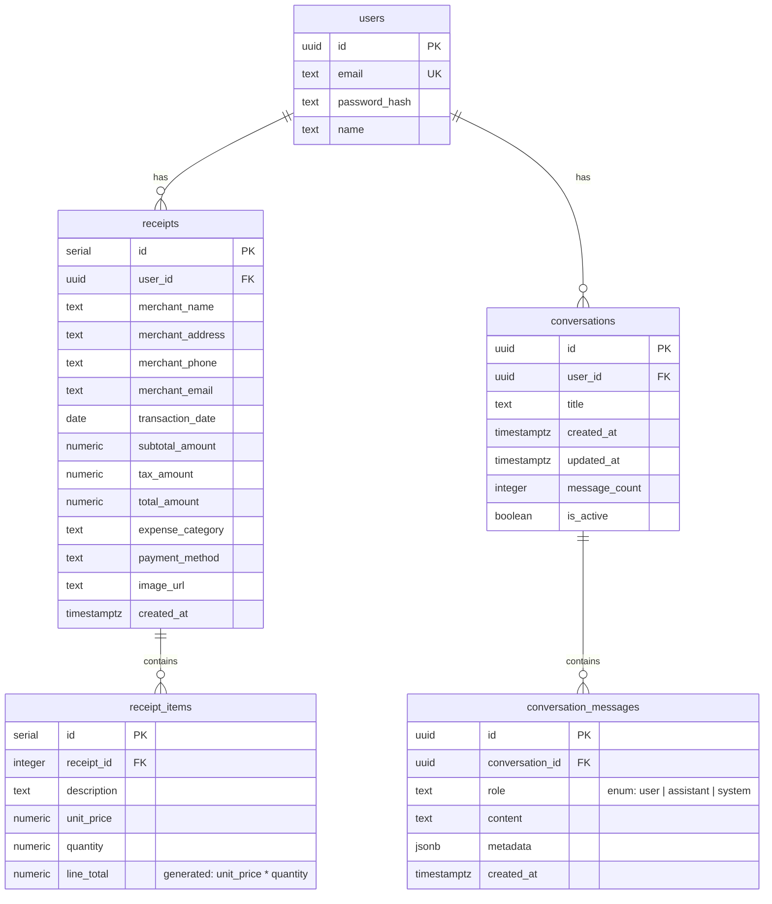
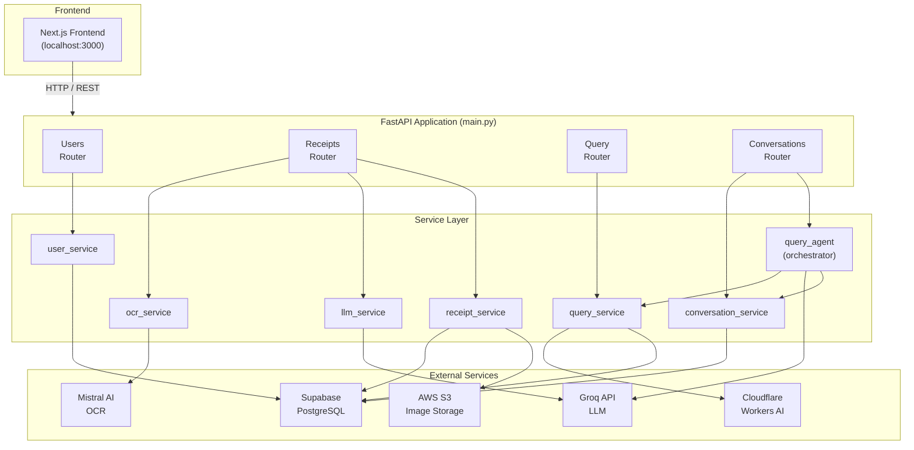
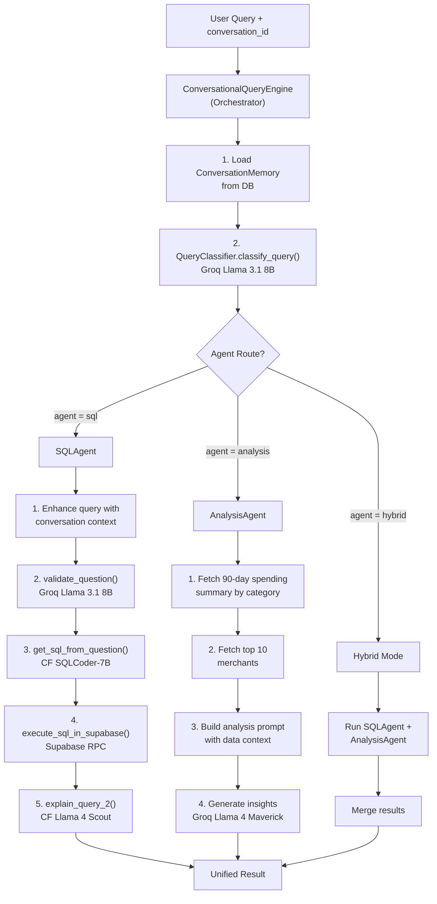
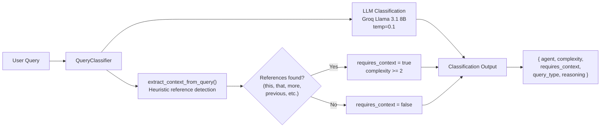
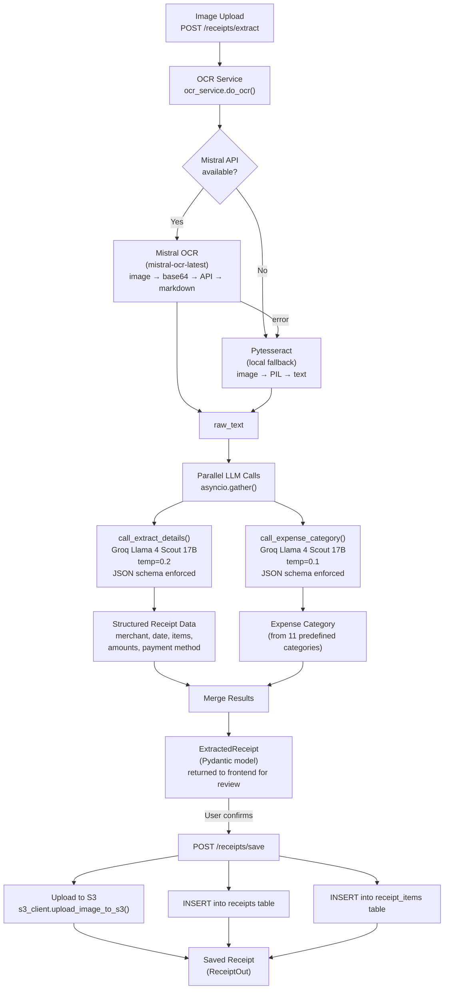
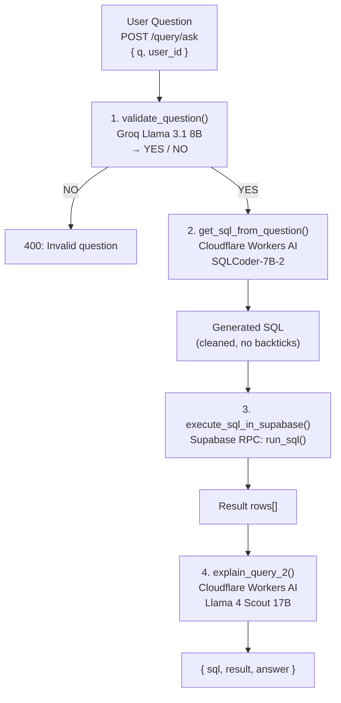
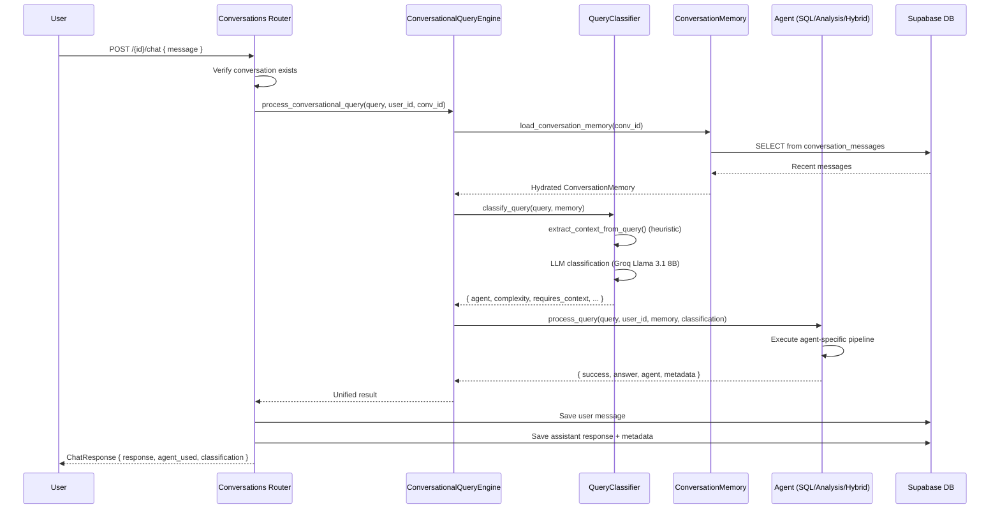
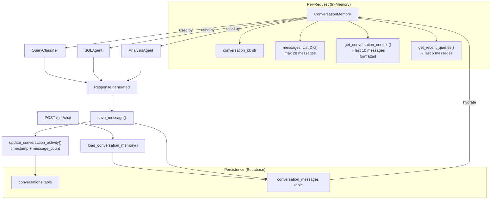

# TrackIt-AI — Low-Level Design (LLD)

## Table of Contents

1. [System Overview](#1-system-overview)
2. [Project Structure](#2-project-structure)
3. [Database Schema (ERD)](#3-database-schema-erd)
4. [High-Level Component Architecture](#4-high-level-component-architecture)
5. [Multi-Agent System Architecture](#5-multi-agent-system-architecture)
6. [Receipt Processing Pipeline](#6-receipt-processing-pipeline)
7. [Natural Language Query Pipeline](#7-natural-language-query-pipeline)
8. [Conversation Memory Architecture](#8-conversation-memory-architecture)
9. [External Service Integrations](#9-external-service-integrations)
10. [API Endpoint Summary](#10-api-endpoint-summary)
11. [Key Design Patterns](#11-key-design-patterns)

---

## 1. System Overview

TrackIt-AI is an **agentic AI-powered personal expense tracker** built with a FastAPI backend. It allows users to upload receipt images, automatically extract structured data using OCR + LLM pipelines, and query their expense data using natural language through a **multi-agent conversational AI system**.

**Core Capabilities:**

- Receipt image processing (OCR + LLM extraction + auto-categorization)
- Natural language to SQL querying with explanation generation
- Multi-turn conversational AI with memory and context awareness
- Multi-agent routing (SQL Agent, Analysis Agent, Hybrid)

---

## 2. Project Structure

```
backend/
├── main.py                        # FastAPI app entry point, CORS, router registration
├── requirements.txt               # Python dependencies
│
├── routers/                       # API layer (controllers)
│   ├── users.py                   #   POST /users/signup, /users/login
│   ├── receipts.py                #   POST /receipts/extract, /receipts/save
│   │                              #   GET  /receipts/user/{user_id}, /{receipt_id}/items
│   ├── query.py                   #   POST /query/ask  (legacy stateless NL→SQL)
│   └── conversations.py           #   CRUD /conversations + POST /{id}/chat
│
├── schemas/                       # Pydantic request/response models
│   ├── receipts.py                #   ExtractedReceipt, ReceiptOut, ItemOut, etc.
│   └── conversation.py            #   ChatMessage, ChatResponse, ConversationResponse
│
├── services/                      # Business logic layer
│   ├── user_service.py            #   create_user(), authenticate()
│   ├── ocr_service.py             #   do_ocr()  — Mistral OCR / Tesseract fallback
│   ├── llm_service.py             #   call_extract_details(), call_expense_category()
│   ├── receipt_service.py         #   save_receipt(), get_receipts(), get_items()
│   ├── query_service.py           #   validate_question(), get_sql_from_question(),
│   │                              #   execute_sql_in_supabase(), explain_query_2()
│   ├── query_agent.py             #   QueryClassifier, SQLAgent, AnalysisAgent,
│   │                              #   ConversationalQueryEngine (orchestrator)
│   ├── conversation_service.py    #   ConversationMemory, CRUD for conversations/messages
│   ├── groq_client.py             #   Singleton Groq client
│   ├── supabase_client.py         #   Singleton Supabase client + hash_password()
│   └── s3_client.py               #   upload_image_to_s3()
│
├── prompts/                       # LLM prompt templates
│   ├── receipt_extract.py         #   get_receipt_parser_prompt(), get_enhanced_category_prompt()
│   └── prompts.py                 #   VALIDATE_PROMPT, SQLCODER_PROMPT_TEMPLATE, EXPLAIN_PROMPT
│
├── constants/
│   └── schemas.py                 #   JSON schemas for structured output, expense_categories[]
│
└── models/
    ├── schemas.sql                #   PostgreSQL DDL (5 tables)
    └── dummy_data.sql             #   Test data
```

---

## 3. Database Schema (ERD)



---

## 4. High-Level Component Architecture



---

## 5. Multi-Agent System Architecture

This is the heart of the agentic AI design — the `query_agent.py` module.

### 5.1 Agent Routing Flow



### 5.2 Query Classification Detail



### 5.3 Agent Specifications

| Component | Role | LLM Used | Temperature |
|---|---|---|---|
| `QueryClassifier` | Classifies intent & complexity (1-3), picks agent route | Groq Llama 3.1 8B Instant | 0.1 |
| `SQLAgent` | Data retrieval — NL to SQL, execute, explain | Cloudflare SQLCoder-7B + CF Llama 4 Scout | — |
| `AnalysisAgent` | Financial insights, patterns, recommendations | Groq Llama 4 Maverick 17B | 0.3 |
| `ConversationalQueryEngine` | Orchestrator — memory loading, routing, result assembly | — | — |

**Classification Complexity Levels:**

| Level | Description | Example |
|---|---|---|
| 1 | Simple data retrieval (basic SQL) | "How much did I spend last week?" |
| 2 | Context-aware follow-ups | "Break that down by category" |
| 3 | Complex analysis (insights, patterns) | "What are my spending trends?" |

---

## 6. Receipt Processing Pipeline



### 6.1 Expense Categories

| Category | Description |
|---|---|
| Groceries | Supermarkets, grocery stores, food markets |
| Dining | Restaurants, cafes, fast food, food delivery |
| Transportation | Gas stations, parking, ride-sharing, public transit |
| Utilities | Electric, water, gas, internet, phone bills |
| Entertainment | Movies, concerts, streaming, games, books |
| Travel | Hotels, flights, car rentals, vacation expenses |
| Health & Wellness | Pharmacy, medical, fitness, beauty |
| Office Supplies | Stationery, computer supplies, business materials |
| Shopping | Clothing, electronics, home goods, general retail |
| Services | Professional services, repairs, maintenance |
| Other | Everything else not fitting above categories |

---

## 7. Natural Language Query Pipeline

### 7.1 Legacy Stateless Query (POST /query/ask)



### 7.2 Conversational Query (POST /conversations/{id}/chat)



---

## 8. Conversation Memory Architecture



**Conversation Lifecycle:**

1. `POST /conversations/` — creates session, returns `conversation_id`
2. `POST /conversations/{id}/chat` — sends message, triggers multi-agent pipeline
3. Both user message and assistant response are persisted to `conversation_messages`
4. On each chat request, memory is rehydrated from DB (last 50 messages, context window = last 10)
5. `POST /conversations/quick-query` — creates ephemeral conversation for one-off questions

---

## 9. External Service Integrations

| Service | Client | Purpose | Models / Endpoints |
|---|---|---|---|
| **Groq** | `groq.Groq` | Primary LLM provider | `llama-3.1-8b-instant` (validation, classification) |
| | | | `llama-4-scout-17b-16e-instruct` (receipt parsing, categorization) |
| | | | `llama-4-maverick-17b-128e-instruct` (analysis, explanations) |
| **Cloudflare Workers AI** | `requests.post()` | Text-to-SQL + query explanation | `@cf/defog/sqlcoder-7b-2` (NL → SQL) |
| | | | `@cf/meta/llama-4-scout-17b-16e-instruct` (explain results) |
| **Mistral AI** | `mistralai.Mistral` | Primary OCR | `mistral-ocr-latest` |
| **Pytesseract** | `pytesseract` | Fallback OCR (local) | Tesseract engine |
| **Supabase** | `supabase-py` | PostgreSQL database | REST API + RPC (`run_sql`) |
| **AWS S3** | `boto3` | Receipt image storage | `put_object` to configured bucket/folder |

### Environment Variables Required

```
SUPABASE_URL, SUPABASE_KEY
GROQ_API_KEY
MISTRAL_API_KEY
CLOUDFLARE_AUTH_TOKEN, CLOUDFLARE_ACCOUNT_ID
AWS_ACCESS_KEY_ID, AWS_SECRET_ACCESS_KEY, AWS_REGION, S3_BUCKET_NAME, S3_FOLDER
PW_SALT
```

---

## 10. API Endpoint Summary

| Method | Endpoint | Router | Description |
|---|---|---|---|
| `POST` | `/users/signup` | users | Create user account |
| `POST` | `/users/login` | users | Authenticate user |
| `POST` | `/receipts/extract` | receipts | OCR + LLM extraction (no save) |
| `POST` | `/receipts/save` | receipts | Save extracted receipt + S3 upload |
| `GET` | `/receipts/user/{user_id}` | receipts | List user's receipts (paginated) |
| `GET` | `/receipts/{receipt_id}/items` | receipts | Get line items for a receipt |
| `POST` | `/query/ask` | query | Stateless NL → SQL query (legacy) |
| `POST` | `/conversations/` | conversations | Create conversation session |
| `GET` | `/conversations/user/{user_id}` | conversations | List user's conversations |
| `GET` | `/conversations/{id}` | conversations | Get conversation details |
| `GET` | `/conversations/{id}/messages` | conversations | Get message history |
| `POST` | `/conversations/{id}/chat` | conversations | Send chat message (multi-agent) |
| `DELETE` | `/conversations/{id}` | conversations | Soft-delete conversation |
| `POST` | `/conversations/quick-query` | conversations | One-off query (ephemeral session) |

---

## 11. Key Design Patterns

### 11.1 Multi-Agent Routing

`QueryClassifier` determines which agent handles the query based on LLM-powered intent classification with heuristic fallback. Three routes exist: `sql` (data retrieval), `analysis` (insights), and `hybrid` (both in parallel).

### 11.2 Parallel LLM Calls

Receipt extraction runs detail parsing and category classification concurrently via `asyncio.gather()`, reducing total latency.

### 11.3 Graceful Degradation

Multiple fallback chains are in place:

- **OCR:** Mistral API → Pytesseract (local)
- **Query explanation:** LLM response → raw JSON dump of rows
- **Classification:** LLM classification → heuristic keyword matching

### 11.4 Sync-to-Async Bridge

Blocking LLM/S3 SDK calls are wrapped in `asyncio.get_running_loop().run_in_executor()` to avoid blocking the FastAPI event loop.

### 11.5 Schema-Enforced LLM Output

Groq's `response_format: { type: "json_schema", json_schema: ... }` ensures structured, parseable output from receipt extraction and categorization — eliminating brittle regex parsing.

### 11.6 Sliding Window Memory

Conversation context is capped at **20 stored messages** with a **10-message context window** passed to LLMs, preventing token overflow while maintaining relevant context.

### 11.7 Two-Phase Receipt Flow

Extract (preview) and Save are separate endpoints, allowing user review and correction of OCR/LLM results before persistence — critical for data accuracy.
