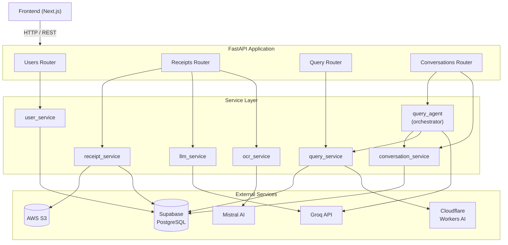
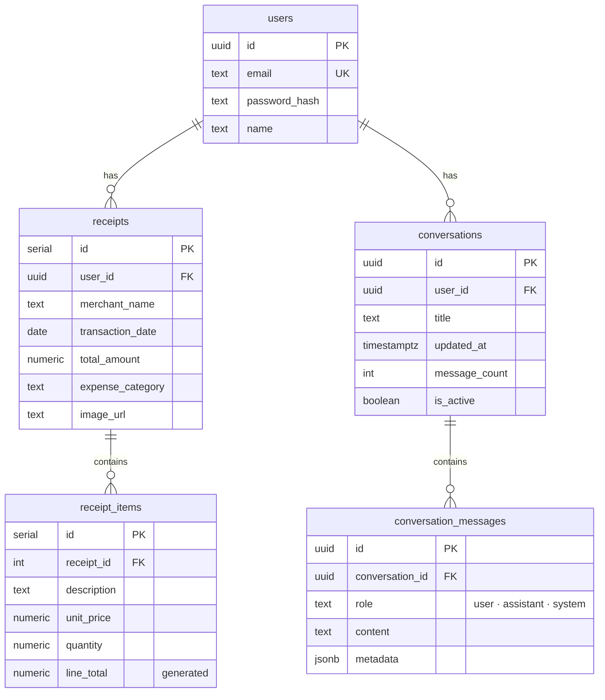
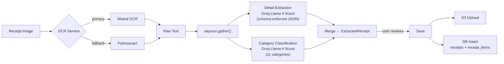
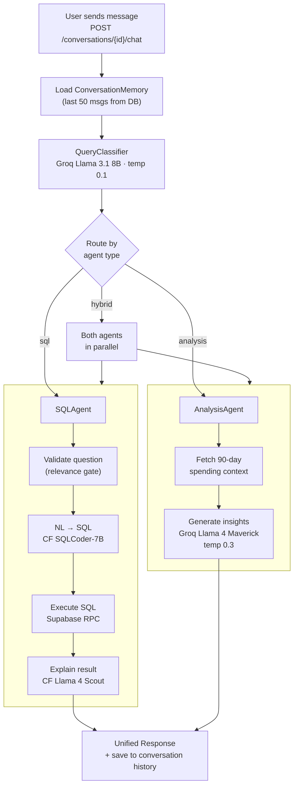
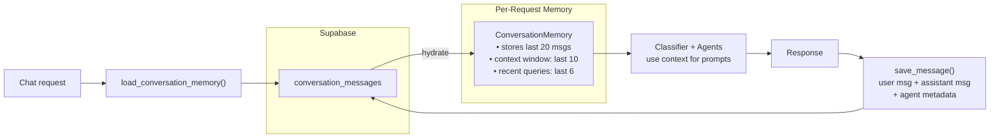
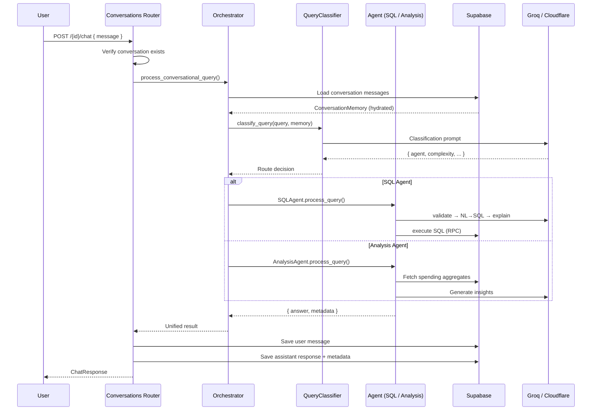

# TrackIt-AI — Architecture (LLD)

> Agentic AI-powered personal expense tracker with receipt OCR, natural language querying, and a multi-agent conversational assistant.

---

## 1. System Overview

TrackIt-AI lets users photograph receipts, automatically extract and categorize expense data, and ask questions about their spending in plain English. The backend is built around three AI-driven pipelines:

| Pipeline | What it does |
|---|---|
| **Receipt Processing** | Image → OCR → LLM extraction + auto-categorization → structured data |
| **NL Query** | Natural language question → SQL generation → execution → friendly explanation |
| **Conversational Agent** | Multi-turn chat with memory, routing queries to specialized agents |

### Tech Stack

- **API:** FastAPI + Uvicorn (async Python)
- **Database:** Supabase (PostgreSQL)
- **Storage:** AWS S3 (receipt images)
- **LLMs:** Groq (Llama family), Cloudflare Workers AI (SQLCoder, Llama 4 Scout)
- **OCR:** Mistral AI (primary), Pytesseract (fallback)
- **Frontend:** Next.js

---

## 2. Component Architecture



---

## 3. Database Schema



---

## 4. Receipt Processing Pipeline

Two-phase flow: **Extract** (preview for user review) → **Save** (persist after confirmation).



**Key details:**
- OCR runs in a thread pool (`run_in_executor`) to avoid blocking the async event loop.
- Extraction and categorization run as **parallel LLM calls** to cut latency.
- LLM output uses **JSON schema enforcement** — no brittle regex parsing.

---

## 5. Multi-Agent Conversational System

This is the core agentic architecture. A central orchestrator classifies each user query and routes it to the right specialized agent.

### 5.1 Agent Routing



### 5.2 Agent Specifications

| Agent | Responsibility | LLM | Temp |
|---|---|---|---|
| **QueryClassifier** | Intent classification, complexity scoring (1–3), agent routing | Groq Llama 3.1 8B | 0.1 |
| **SQLAgent** | Data retrieval — validate → NL-to-SQL → execute → explain | CF SQLCoder-7B + CF Llama 4 Scout | — |
| **AnalysisAgent** | Financial patterns, insights, recommendations using aggregated data | Groq Llama 4 Maverick 17B | 0.3 |
| **Orchestrator** | Memory loading, classification dispatch, result assembly | — | — |

### 5.3 Classification Schema

The classifier outputs a structured JSON decision:

```json
{
  "agent": "sql | analysis | hybrid",
  "complexity": 1,
  "requires_context": false,
  "query_type": "data_retrieval | analysis | recommendation | follow_up",
  "reasoning": "..."
}
```

| Complexity | Meaning | Example |
|---|---|---|
| 1 | Simple data retrieval | *"How much did I spend last week?"* |
| 2 | Context-aware follow-up | *"Break that down by category"* |
| 3 | Complex analysis | *"What are my spending trends?"* |

A heuristic layer detects reference words (*"this", "that", "more", "previous"*) and overrides complexity to >= 2 when conversational context is needed.

---

## 6. Conversation Memory



Memory is **rehydrated from the database on every request** (stateless server), with a sliding window to keep LLM prompts within token limits.

---

## 7. Request Flow — Conversational Query (end-to-end)



---

## 8. API Surface

| Method | Endpoint | Purpose |
|---|---|---|
| `POST` | `/users/signup` | Create account |
| `POST` | `/users/login` | Authenticate |
| `POST` | `/receipts/extract` | OCR + LLM extraction (preview) |
| `POST` | `/receipts/save` | Persist receipt + S3 upload |
| `GET` | `/receipts/user/{user_id}` | List receipts (paginated) |
| `GET` | `/receipts/{id}/items` | Get line items |
| `POST` | `/query/ask` | One-shot NL → SQL query |
| `POST` | `/conversations/` | Create conversation |
| `GET` | `/conversations/user/{user_id}` | List conversations |
| `POST` | `/conversations/{id}/chat` | Send message (multi-agent) |
| `POST` | `/conversations/quick-query` | One-off query (ephemeral session) |
| `DELETE` | `/conversations/{id}` | Soft-delete conversation |

---

## 9. Key Design Decisions

| Pattern | How it's applied |
|---|---|
| **Multi-Agent Routing** | LLM-powered classifier picks between SQL, Analysis, or Hybrid agents per query |
| **Parallel LLM Calls** | Receipt extraction + categorization run concurrently via `asyncio.gather()` |
| **Graceful Degradation** | OCR: Mistral → Tesseract; Explanation: LLM → raw JSON; Classification: LLM → heuristic |
| **Schema-Enforced Output** | Groq `json_schema` response format guarantees parseable structured output |
| **Sliding Window Memory** | 20-message store, 10-message context window prevents token overflow |
| **Two-Phase Receipt Flow** | Extract (preview) and Save are separate — user can review/correct before persisting |
| **Sync-to-Async Bridge** | Blocking SDK calls wrapped in `run_in_executor()` to keep the event loop non-blocking |
